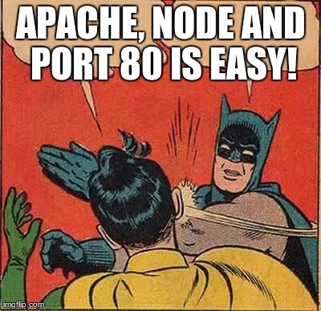

nodeProxyLAMP
=============

installscript for Linuxservers to have a node multi-app, multi-port environment up and running in no time in conjunction with Apache.

Problem
=======
Node is fun, but to get a productionserver going which is plug'n'play for multiple node-apps is timeconsuming.

 

Solution
========
This is a plugnplay solution which can be installed by running one install.sh-script, it installs:

    * forever             <-- tool which restarts apps automatically upon crash/suprises etc
    * /etc/init.d/forever <-- an initd-script which can start/stop/restart/list app(s)..or all at once during reboot
    * /etc/forever.d/     <-- directory where each configfile represents an node app on a specific port
    * proxyServer         <-- a router which sits on port 80, and which can redirect any request internally to other ports

This is a mashup of akuznecov's [initscript](https://github.com/akuznecov/forever-initscript) (slightly modified) and the http-proxy module.

How
===
Well you can run this:

    (login to your new productionserver)
    git clone https://github.com/coderofsalvation/nodeServerPlatform.git
    cd nodeServerPlatform
    sudo ./install.sh

Done!
(or review [install.sh](https://github.com/coderofsalvation/nodeServerPlatform/blob/master/install.sh) if you wanna check before doing that.    )

then..wipe your tears of joy and make sure other services (apache/lighthttpd e.g.) are no longer running on port 80, but on 81.
Then, review /etc/forever.d/proxyserver.conf to your likings:

    { 
        "some.domain.org":    "127.0.0.1:81",               <-- redirects to apache/lighthttpd
        "some.other.com":     "127.0.0.1:8002",             <-- redirects to something else
        "some.other.com/foo": "127.0.0.1:8003/socket.io",   <-- socket.io websocket redirect
    }

Now your browser\'s websocket request can be easily done in Chrome e.g. by writing:

    

(For more sexy routing read [this](http://blog.nodejitsu.com/http-proxy-intro) )
Then run as root:

    sudo update-rc.d foobar defaults
    sudo /etc/init.d/forever start

Dependancies
============
The install.sh-script installs dependancies automatically, but just for convenience here are the local moduleversions 
which were used for testing:

    └─┬ http-proxy@0.10.3
      ├── colors@0.6.2
      ├─┬ optimist@0.3.7
      │ └── wordwrap@0.0.2
      ├── pkginfo@0.2.3
      └─┬ utile@0.1.7
        ├── async@0.1.22
        ├── deep-equal@0.0.0
        ├── i@0.3.2
        ├── mkdirp@0.3.5
        ├── ncp@0.2.7
        └── rimraf@1.0.9
    
